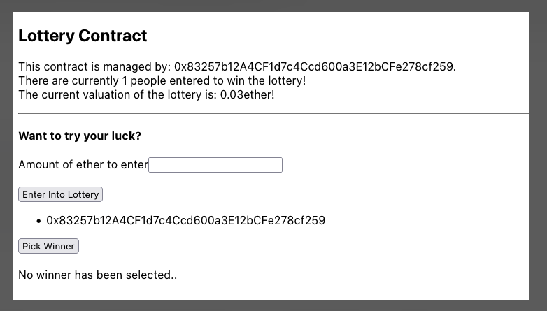

# Crypto Lottery

Decentralized lottery implementation designed to run on the Ethereum Rinkeby test network.

You can view the list of transactions on the deployed contract by [clicking this link to load Etherscan.](https://rinkeby.etherscan.io/address/0x83257b12a4cf1d7c4ccd600a3e12bcfe278cf259)

## Project Structure

The project is structured into 2 main components:

- `blockchain`
    - Handles the solidity contract and logic that connects into the Ethereum blockchain network (Rinkeby in this instance).
    - Compilation to generate the application binary interface (ABI)
    - Deployment automation for deploying the contract to the specified network
    - Unit tests module to test the logic of the module and verify it's correctness.

- `ux`
    - Handles the frontend component in `React`
    - Enables a user to join lottery by submitting `transactions` from a users wallet using `metamask`

## How It Works?

This is decentralized application, there is no server or entity that controls the application once it's deployed. The logic of the application exists in the contract underneath `blockchain` dir and is _immutable_.

Users can offer > .2 `ETH` via the application and sign the transaction via `Metamask` plugin. 

Once the transaction is added to a block that some remote miner has mined, the user has entered into the lottery.

A `manager` - ie _contract owner` (addres in which deployed the contract originally) is able to select a winner, which will randomly select a public key stored in the contract at random.

Once a winner is selected, the balance of the contract (minus gas fees) will be automatically transferred into the winners wallet.

## Tests    

You can run a suite of end-to-end tests that verify the correctness of the contract. This is done by leveraging an in-memory (single node) test network that mimicks the Ethereum blockchain. The test instances are pre-loaded with accounts having ~100ETH.

0. `cd ux && npm i` - install deps
1. `cd ux && npm run test` - run tests via mocha

## Deploying Contract

Check out the `deploy.js` file to ensure you mneumonic and network node IP or DNS name to the network you want to connect to is specified properly.

`npm run deploy` will deploy the contract by compiling the contract into EVM executable bytecode. This bytecode is what is run on the nodes in the blockchain via the EVM (Ethereum virtual machine).

We output the application binary interface to act as a proxy/intermediary which enables high-level interpreted languages like JS to interface with the blockchain from the browser safely and securely.

Migrating the ABI as the contract changes as well as the 64 bit hash into the UI will be the bridge for connectivity. 